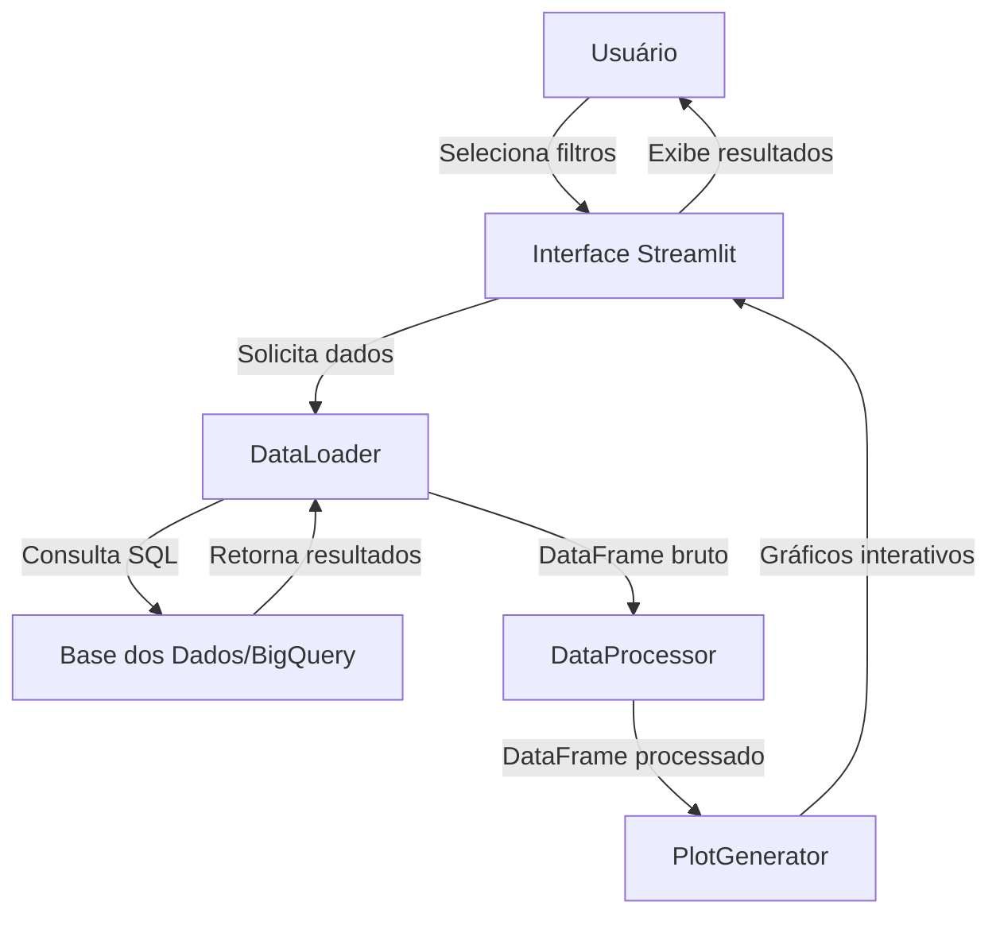
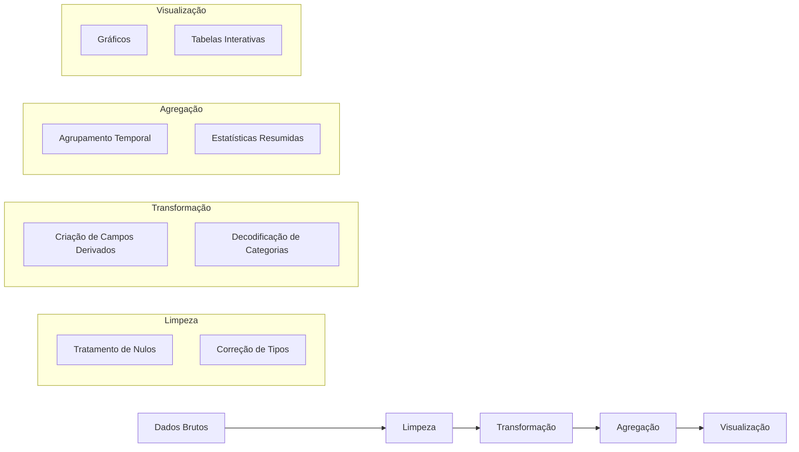
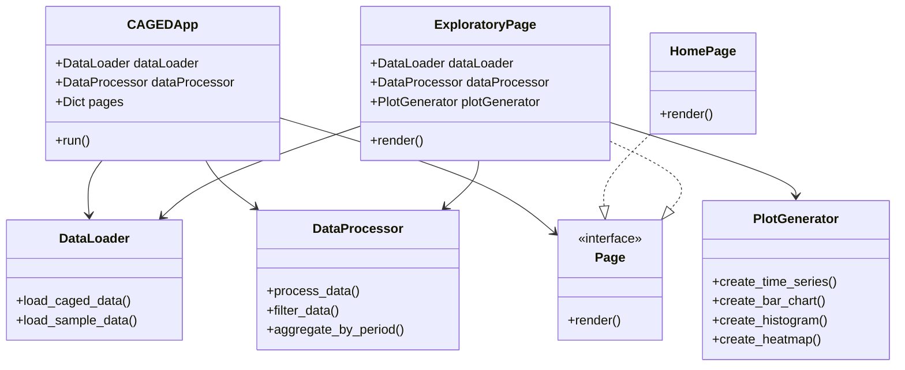

# Análise de Dados do CAGED com Streamlit

Este projeto implementa um dashboard interativo para análise exploratória dos dados do Cadastro Geral de Empregados e Desempregados (CAGED) do Ministério da Economia do Brasil. O projeto utiliza a Base dos Dados como fonte dos dados.

## 📊 Sobre o CAGED

O Cadastro Geral de Empregados e Desempregados (CAGED) foi instituído pela Lei nº 4.923, em 23 de dezembro de 1965. É uma fonte de informação nacional de periodicidade mensal que registra as admissões e demissões de trabalhadores sob o regime da CLT. É uma ferramenta importante para monitorar o mercado de trabalho formal brasileiro.

## 📝 Estrutura para Apresentação em Seminário

Este README fornece diretrizes para a apresentação do projeto em um seminário de análise de dados, dividido em quatro partes principais que podem ser distribuídas entre os membros da equipe.

### 1. Introdução e Contextualização (Apresentador 1)
- **Descrição do CAGED e sua importância**
  - História e contexto do CAGED
  - Importância para políticas públicas
  - Principais indicadores e métricas
- **Objetivos do projeto**
  - Democratização do acesso aos dados
  - Facilitação da análise exploratória
  - Automação de insights sobre o mercado de trabalho
- **Demonstração inicial do dashboard**
  - Navegação pela interface
  - Principais recursos e funcionalidades

### 2. Recursos Tecnológicos e Arquitetura (Apresentador 2)
- **Stack tecnológica utilizada**
  - Python e suas bibliotecas
  - Streamlit como framework de dashboard
  - Base dos Dados como fonte de dados
- **Estrutura do projeto**
  - Organização em módulos e classes
  - Princípios SOLID aplicados
  - Fluxo de dados e processamento
- **Desafios técnicos enfrentados**
  - Acesso e consulta a grandes volumes de dados
  - Otimização de consultas SQL
  - Gestão de memória e performance

### 3. Análise Exploratória e Visualizações (Apresentador 3)
- **Metodologias de análise exploratória implementadas**
  - Análise univariada, bivariada e multivariada
  - Análise temporal e sazonal
  - Filtragem e agregação de dados
- **Tipos de visualizações disponíveis**
  - Séries temporais e tendências
  - Distribuições estatísticas
  - Comparativos categóricos
  - Correlações e relações
- **Demonstração prática das visualizações**
  - Casos de uso reais com dados do CAGED
  - Interpretação dos resultados visuais

### 4. Insights e Conclusões (Apresentador 4)
- **Principais descobertas dos dados**
  - Tendências do mercado de trabalho
  - Disparidades regionais e setoriais
  - Impactos sazonais e externos
- **Limitações e considerações metodológicas**
  - Vieses e lacunas nos dados
  - Considerações estatísticas
  - Contexto econômico e social
- **Direções futuras**
  - Implementação de algoritmos preditivos
  - Expansão para outras bases de dados
  - Melhorias na interface e usabilidade

## 🔍 A Importância da Análise Exploratória de Dados

A Análise Exploratória de Dados (AED) é uma abordagem fundamental em ciência de dados pelos seguintes motivos:

- **Compreensão dos dados**: Permite entender a estrutura, padrões, relações e anomalias nos dados
- **Geração de hipóteses**: Facilita a identificação de questões relevantes que podem ser investigadas
- **Limpeza de dados**: Auxilia na identificação de valores ausentes, outliers e inconsistências
- **Seleção de features**: Ajuda a identificar quais variáveis são mais relevantes para análises posteriores
- **Comunicação de resultados**: Fornece visualizações que facilitam a compreensão dos resultados

No contexto do CAGED, a análise exploratória nos permite:
- Identificar tendências de emprego e desemprego ao longo do tempo
- Analisar diferenças regionais no mercado de trabalho
- Observar padrões por setor econômico, faixa etária, gênero e escolaridade
- Detectar sazonalidades nas contratações e demissões
- Gerar insights para políticas públicas de emprego

## ⚙️ Recursos Tecnológicos Utilizados

### Linguagens e Bibliotecas
- **Python 3.9+**: Linguagem principal do projeto
- **Streamlit**: Framework para desenvolvimento de aplicações web com foco em dados
- **Pandas/NumPy**: Manipulação e processamento de dados
- **Plotly**: Visualizações interativas
- **Matplotlib/Seaborn**: Visualizações estáticas complementares
- **BaseDosDADOS**: API para acesso aos dados do CAGED
- **dotenv**: Gestão de variáveis de ambiente e configurações

### Fonte de Dados
- **Base dos Dados**: Plataforma que democratiza o acesso a dados públicos de alta qualidade no Brasil
- **Google BigQuery**: Serviço de data warehouse utilizado pela Base dos Dados
- **SQL**: Linguagem utilizada para consultar os dados no BigQuery

### Padrões de Desenvolvimento
- **Orientação a Objetos**: Estruturação do código em classes e métodos
- **Princípios SOLID**: Aplicação de boas práticas de design de software
- **Separation of Concerns**: Separação clara entre acesso a dados, processamento e visualização

## 📊 Técnicas de Análise Exploratória Aplicadas

### Análise Univariada
- **Distribuições estatísticas**: Histogramas para variáveis contínuas como salário e idade
- **Frequências**: Gráficos de barras e pizza para variáveis categóricas como UF e setor
- **Estatísticas descritivas**: Médias, medianas, quartis e desvios padrão

### Análise Bivariada
- **Correlações**: Mapas de calor para correlações entre variáveis numéricas
- **Gráficos de dispersão**: Relações entre pares de variáveis como salário e idade
- **Boxplots agrupados**: Distribuição de salários por UF, sexo e escolaridade

### Análise Temporal
- **Séries temporais**: Evolução de admissões e demissões ao longo do tempo
- **Comparações mensais**: Identificação de sazonalidades no mercado de trabalho
- **Comparações anuais**: Análise comparativa entre diferentes anos

### Análise Geoespacial
- **Distribuição regional**: Contrastes entre diferentes regiões e estados
- **Concentração setorial**: Análise de setores predominantes por região

## 🔄 Fluxo de Dados e Arquitetura do Sistema

### Pipeline de Processamento de Dados

### Arquitetura de Classes

## 📋 Guia para Demonstração no Seminário

### Preparação
1. Configurar o ambiente com as dependências necessárias
2. Verificar o acesso à Base dos Dados (credenciais no arquivo .env)
3. Preparar exemplos de consultas e visualizações para demonstração

### Roteiro Sugerido para Apresentação (20-30 minutos)
- **Introdução (5 min)**: Apresentador 1
- **Arquitetura e Tecnologias (5 min)**: Apresentador 2
- **Demonstração do Dashboard (10 min)**: Apresentador 3
- **Insights e Conclusões (5 min)**: Apresentador 4
- **Perguntas e Respostas (5 min)**: Todos os apresentadores

### Dicas para Apresentação
- Prepare-se para explicar conceitos técnicos de forma acessível
- Utilize exemplos concretos para ilustrar funcionalidades
- Destaque as decisões de design e suas justificativas
- Enfatize os insights que podem ser obtidos através da análise exploratória
- Demonstre como o projeto pode ser expandido com novas funcionalidades

## 🚀 Funcionalidades Implementadas

- **Filtros Interativos**: Seleção de períodos, regiões e variáveis de interesse
- **Análise Exploratória**: Visualizações interativas dos dados do CAGED
- **Estatísticas Descritivas**: Resumos numéricos das principais métricas
- **Exportação de Dados**: Download dos dados filtrados para análise externa
- **Visualizações Customizáveis**: Diversos tipos de gráficos para diferentes análises

## 📚 Referências e Recursos Adicionais

- [Documentação do CAGED](https://www.gov.br/trabalho-e-emprego/pt-br/assuntos/empregador/caged)
- [Base dos Dados - CAGED](https://basedosdados.org/dataset/562b56a3-0b01-4735-a049-eeac5681f056?table=95106d6f-e36e-4fed-b8e9-99c41cd99ecf)
- [Documentação do Streamlit](https://docs.streamlit.io/)
- [Plotly Python](https://plotly.com/python/)
- [Pandas Documentation](https://pandas.pydata.org/docs/)

